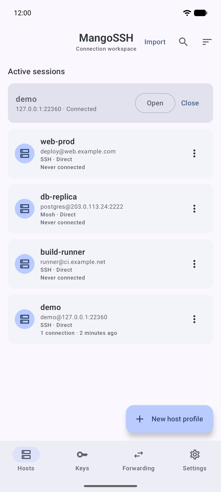
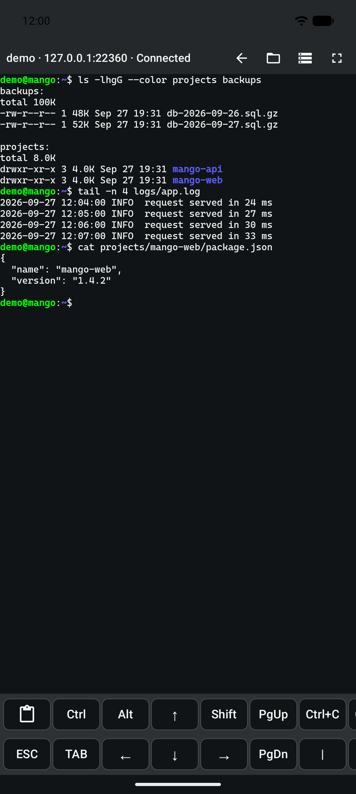
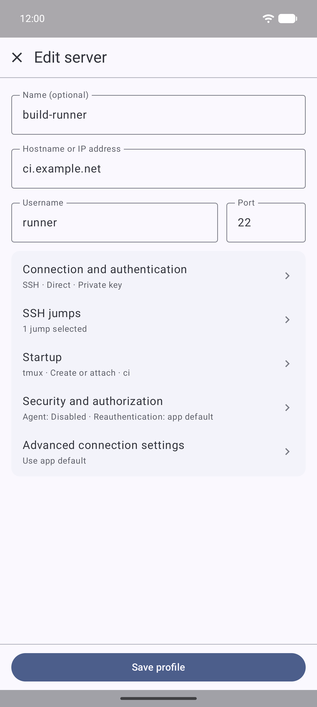
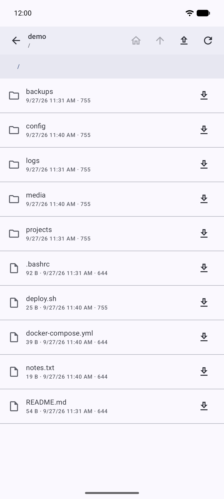
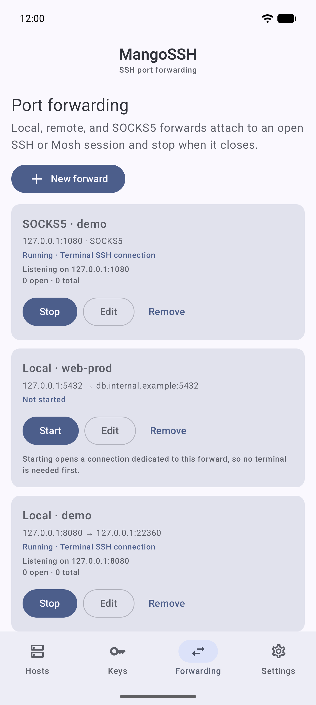
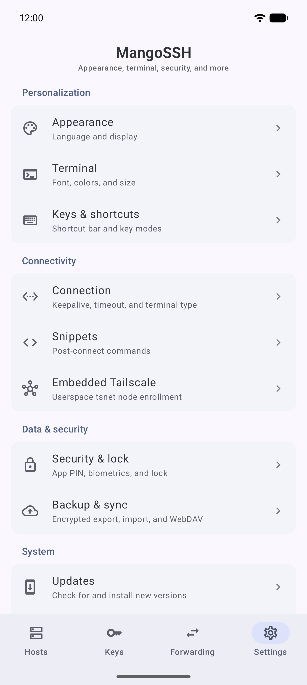

# MangoSSH

**English** | [简体中文](README.zh-CN.md)

A free and open-source SSH and Mosh client for Android phones and tablets. Your
profiles and keys stay in an encrypted vault, with encrypted backups you can
keep on your own WebDAV server.

<p>
  
  
  
  
  
  
</p>

## Features

**Sessions**
- SSH and native Mosh terminals. Mosh keeps an authenticated SSH companion
  connection for files, port forwards and server resource reports.
- Jump hosts, SSH agent forwarding, and optional tmux workspaces that reattach
  on reconnect.
- Snippets that run automatically when a shell opens.
- Live connection health, and sessions that stay up in the background.

**Authentication and security**
- Password, private-key, and keyboard-interactive authentication, with
  one-time password prompts.
- Explicit host-key confirmation and a clear warning when a saved key changes.
- Generate, import, and export RSA, ECDSA, and Ed25519 keys.
- Profiles, keys, and host fingerprints are kept in an encrypted local vault.
- App lock with PIN or biometrics and a configurable auto-lock delay.

**Files**
- Browse hosts over SFTP; upload and download single files or whole folders.
- Pause, resume, cancel, and retry transfers. A transfer interrupted by a lost
  connection can continue after you reconnect to the same verified host.
- Edit small text files in place, with a diff preview before saving and
  encrypted drafts.

**Port forwarding**
- Local, remote, and SOCKS5 rules. A rule reuses an open session for the same
  host, or opens its own connection so no terminal needs to stay open.

**Networking**
- Per-profile route: direct, the system Tailscale VPN, or an embedded,
  outbound-only Tailscale node (tsnet) that needs no VPN permission.

**Terminal**
- Bundled Cascadia Mono PL, JetBrains Mono NL, and Fira Code fonts.
- Mango Dark, Dracula, Nord, and Solarized themes, or custom colors.
- Configurable shortcut bar, scrollback, pinch-to-zoom, and immersive mode.

**Backup and more**
- Encrypted file and WebDAV backups with a preview before merging, local
  recovery points, and remote history.
- Import hosts from an OpenSSH `config` file.
- English and Simplified Chinese; two-pane layout on tablets.

See [Using MangoSSH](docs/usage.md) for details of forwarding, transfers,
terminal appearance and network routes.

## Install

Requires Android 8.0 (API 26) or later.

- **GitHub Releases**: download `MangoSSH-v<version>.apk` from the
  [latest release](https://github.com/sunging/MangoSSH/releases/latest). Each
  release publishes a `SHA256SUMS` file for verifying the download.
- **F-Droid**: coming soon.
  <!-- TODO: add F-Droid badge and link once listed -->

### Distributions

MangoSSH is built in two flavors from the same source:

| | `github` | `fdroid` |
| --- | --- | --- |
| Where | GitHub Releases | F-Droid (coming soon) |
| In-app updates | Checks GitHub Releases, verifies SHA-256, hands off to the system installer | Not included, and no install-packages permission |

## Privacy

- No advertisements, analytics, or trackers.
- Passwords, private keys, passphrases, OTP answers, host fingerprints, and Mosh
  session keys are never logged or shown in diagnostics.
- The `github` flavor contacts the GitHub API only when you check for updates,
  or when you turn on the automatic check (at most once every 24 hours). It
  never sends a GitHub token.
- Embedded Tailscale stays off until you enable it and sign in to your own
  tailnet.

## Building from source

```text
git clone https://github.com/sunging/MangoSSH.git
cd MangoSSH
git submodule update --init --recursive
gradlew.bat :app:assembleGithubDebug
```

Use JDK 17 and an Android SDK. Building the native Mosh client needs a Linux
x86_64 host (WSL works on Windows). See [Building MangoSSH](docs/building.md)
for the native build, 16 KiB page-size checks, and the offline F-Droid build.

## Documentation

- [Using MangoSSH](docs/usage.md): forwarding, transfers, terminal appearance,
  language, network routes, and in-app updates
- [Backup and restore](docs/backup-and-restore.md): merge rules, recovery
  points, version compatibility, WebDAV requirements
- [Embedded tsnet](docs/embedded-tsnet.md): scope, pinned toolchain, security
  boundaries, verification
- [Building MangoSSH](docs/building.md): native Mosh, 16 KiB alignment, F-Droid
  source build
- [Versioning and releases](docs/releasing.md): version codes, Release Please,
  CI
- [CI signing isolation](docs/ci-signing.md)
- [Changelog](CHANGELOG.md)

## Contributing

Read [AGENTS.md](AGENTS.md) before opening a pull request. It covers the
architecture, secret-handling rules, string-resource requirements, the
verification commands, and the Conventional Commits workflow.

## License

MangoSSH is licensed under [GPL-3.0-or-later](LICENSE). It bundles a native Mosh
client built from [mosh4android](https://github.com/connectbot/mosh4android);
[THIRD_PARTY_NOTICES.md](THIRD_PARTY_NOTICES.md) lists the Mosh source and build
provenance and the licenses of the bundled fonts and color themes.
