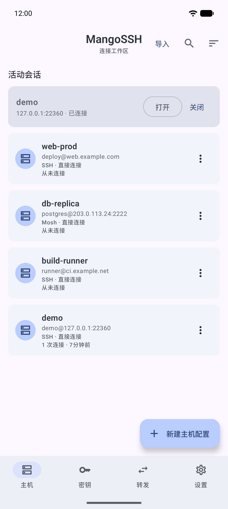
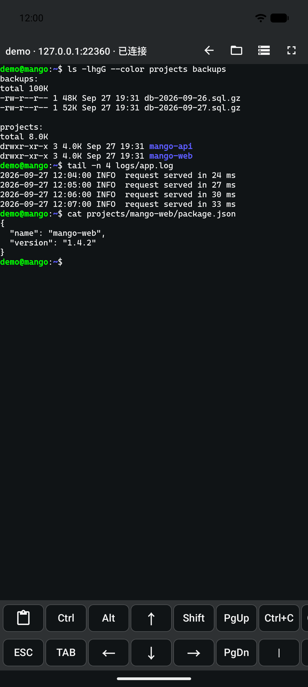
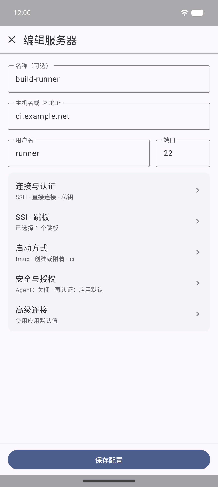
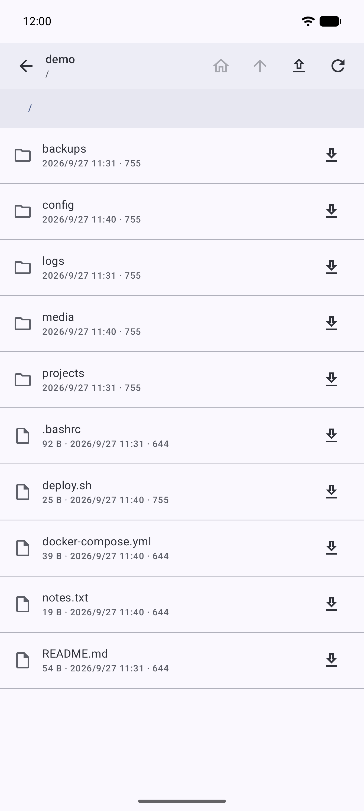
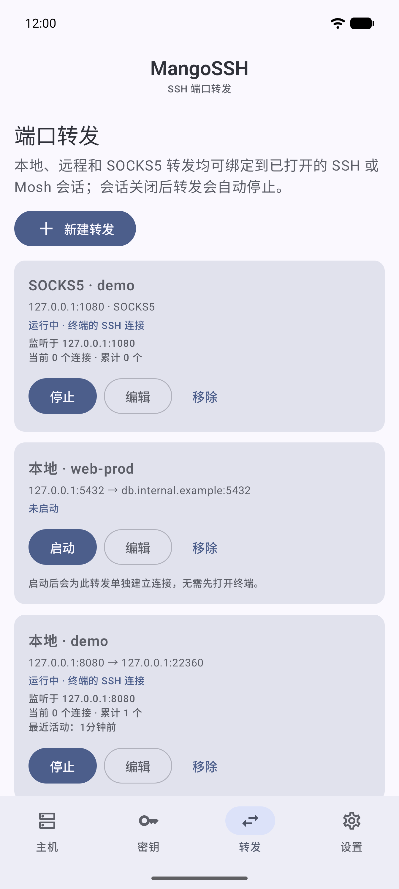
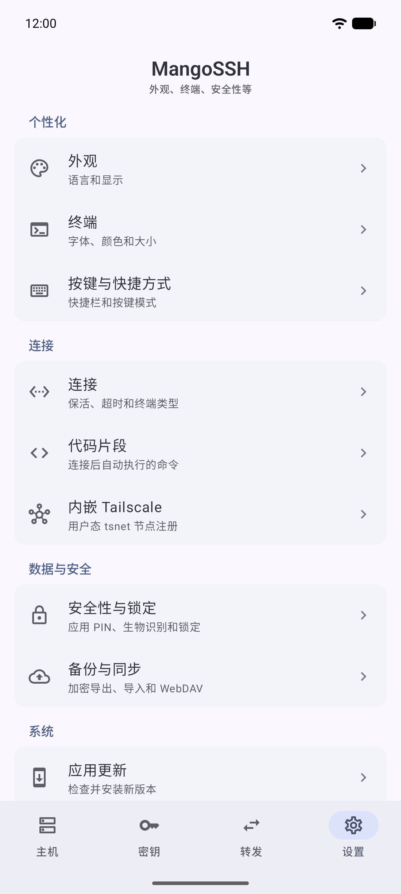

# MangoSSH

[English](README.md) | **简体中文**

面向 Android 手机和平板电脑的自由开源 SSH 与 Mosh 客户端。连接配置和密钥保存在加密保险库中，加密备份可以存放在你自己的 WebDAV 服务器上。

<p>
  
  
  
  
  
  
</p>

## 功能

**会话**
- SSH 终端和原生 Mosh 终端。Mosh 会话保留一条已认证的 SSH 伴随连接，用于文件、端口转发和服务器资源信息。
- 跳板主机、SSH agent 转发，以及可选的 tmux 工作区（重连后自动重新接入）。
- 代码片段：Shell 打开后自动执行。
- 实时连接健康状态，会话可在后台保持运行。

**认证与安全**
- 密码、私钥和键盘交互认证，支持一次性密码提示。
- 首次连接需明确确认主机密钥，已保存的密钥变化时给出明确警告。
- 生成、导入和导出 RSA、ECDSA、Ed25519 密钥。
- 连接配置、密钥和主机指纹保存在本地加密保险库中。
- 应用锁支持 PIN 和生物识别，自动锁定延迟可调。

**文件**
- 通过 SFTP 浏览主机，上传、下载单个文件或整个文件夹。
- 传输可暂停、继续、取消和重试。连接断开后，重新连接到同一台已验证的主机即可继续未完成的传输。
- 直接编辑小型文本文件，保存前预览差异，未保存的草稿加密保存。

**端口转发**
- 本地、远程和 SOCKS5 规则。规则会复用同一主机已打开的会话，也可以单独建立连接，无需保持终端打开。

**网络**
- 每个连接配置可选路由：直连、系统 Tailscale VPN，或仅出站的内嵌 Tailscale 节点（tsnet，无需 VPN 权限）。

**终端**
- 内置 Cascadia Mono PL、JetBrains Mono NL 和 Fira Code 字体。
- Mango Dark、Dracula、Nord、Solarized 主题，也可自定义颜色。
- 快捷键栏、回滚行数、双指缩放和沉浸模式均可配置。

**备份及其他**
- 加密的文件备份与 WebDAV 备份：合并前可预览，支持本地恢复点和远程历史版本。
- 从 OpenSSH `config` 文件导入主机。
- 支持英文和简体中文；平板上使用双栏布局。

转发、传输、终端外观和网络路由的详细说明见 [Using MangoSSH](docs/usage.md)（英文）。

## 安装

需要 Android 8.0（API 26）或更高版本。

- **GitHub Releases**：从[最新版本](https://github.com/sunging/MangoSSH/releases/latest)下载 `MangoSSH-v<版本号>.apk`。每个版本都附带 `SHA256SUMS` 文件，可用于校验下载内容。
- **F-Droid**：即将上架。
  <!-- TODO: F-Droid 上架后补充徽章和链接 -->

### 发行版本

MangoSSH 由同一份源码构建出两个版本：

| | `github` | `fdroid` |
| --- | --- | --- |
| 获取渠道 | GitHub Releases | F-Droid（即将上架） |
| 应用内更新 | 检查 GitHub Releases，校验 SHA-256，交由系统安装程序安装 | 不包含，也不申请安装应用权限 |

## 隐私

- 不含广告、统计分析或跟踪器。
- 密码、私钥、密码短语、一次性密码答案、主机指纹和 Mosh 会话密钥不会写入日志，也不会出现在诊断信息中。
- `github` 版本只在你手动检查更新，或开启自动检查（最多每 24 小时一次）时访问 GitHub API，且从不发送 GitHub 令牌。
- 内嵌 Tailscale 默认关闭，需要你主动启用并登录自己的 tailnet。

## 从源码构建

```text
git clone https://github.com/sunging/MangoSSH.git
cd MangoSSH
git submodule update --init --recursive
gradlew.bat :app:assembleGithubDebug
```

需要 JDK 17 和 Android SDK。构建原生 Mosh 客户端需要 Linux x86_64 环境（Windows 上可使用 WSL）。原生构建、16 KiB 页面大小校验和离线 F-Droid 构建见 [Building MangoSSH](docs/building.md)（英文）。

## 文档

以下文档均为英文：

- [Using MangoSSH](docs/usage.md)：转发、传输、终端外观、语言、网络路由和应用内更新
- [Backup and restore](docs/backup-and-restore.md)：合并规则、恢复点、版本兼容性、WebDAV 要求
- [Embedded tsnet](docs/embedded-tsnet.md)：功能范围、固定版本的工具链、安全边界、验证
- [Building MangoSSH](docs/building.md)：原生 Mosh、16 KiB 对齐、F-Droid 源码构建
- [Versioning and releases](docs/releasing.md)：版本号、Release Please、CI
- [CI signing isolation](docs/ci-signing.md)
- [Changelog](CHANGELOG.md)

## 参与贡献

提交 Pull Request 前请阅读 [AGENTS.md](AGENTS.md)，其中包括架构说明、机密信息处理规则、字符串资源要求、验证命令和 Conventional Commits 提交规范。

## 许可证

MangoSSH 以 [GPL-3.0-or-later](LICENSE) 许可发布。应用内置的原生 Mosh 客户端基于 [mosh4android](https://github.com/connectbot/mosh4android) 构建；Mosh 源码与构建来源，以及内置字体和配色主题的许可证，见 [THIRD_PARTY_NOTICES.md](THIRD_PARTY_NOTICES.md)。
